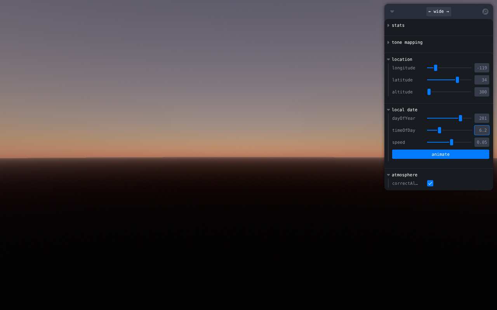
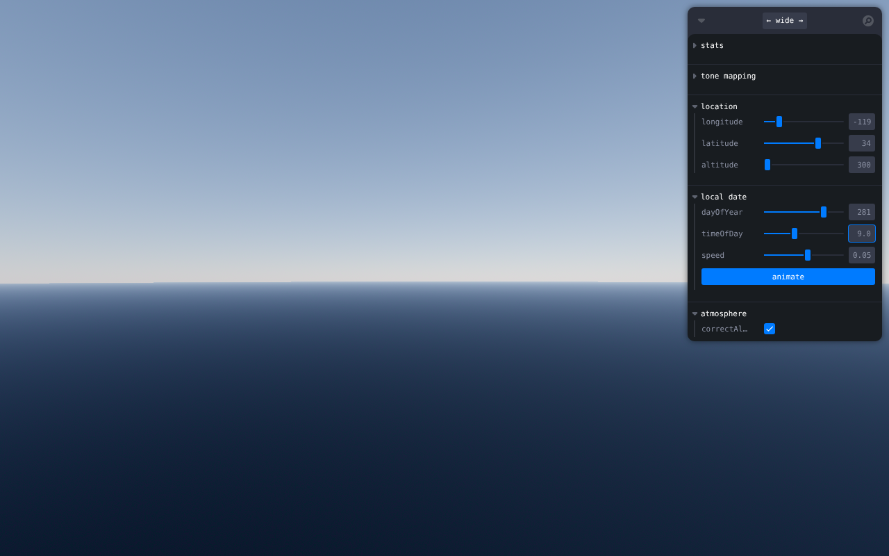
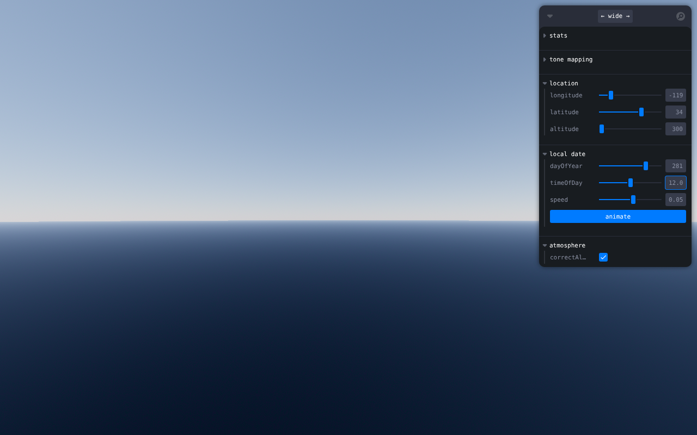
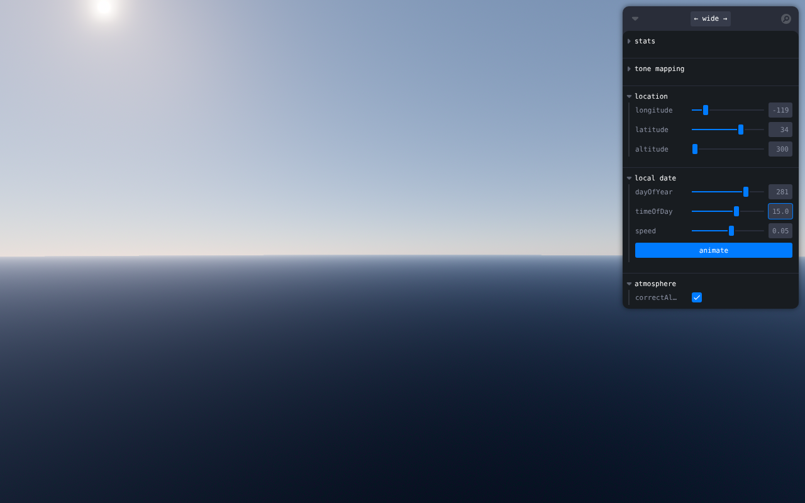
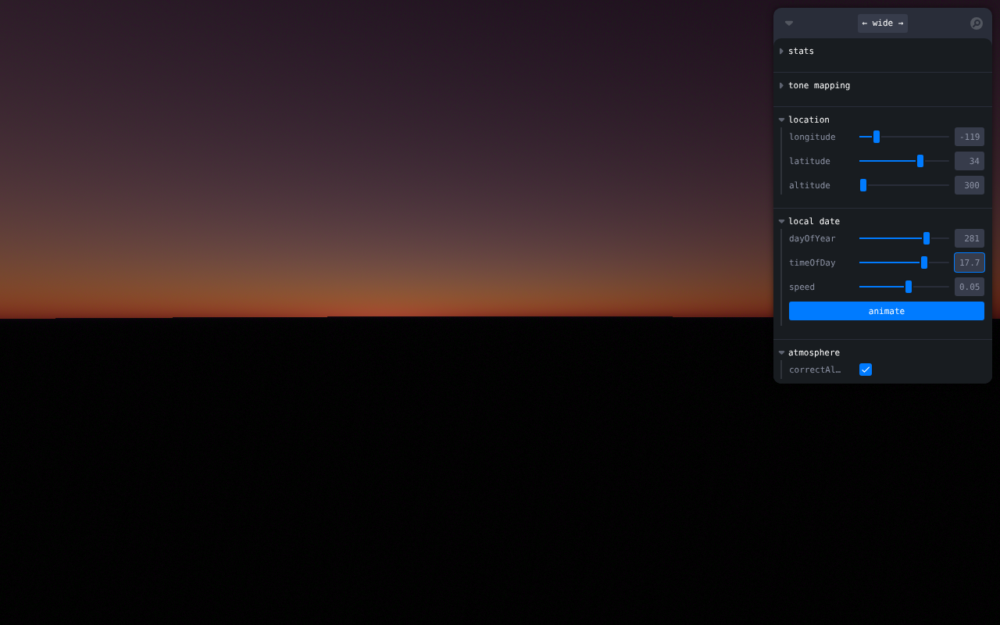
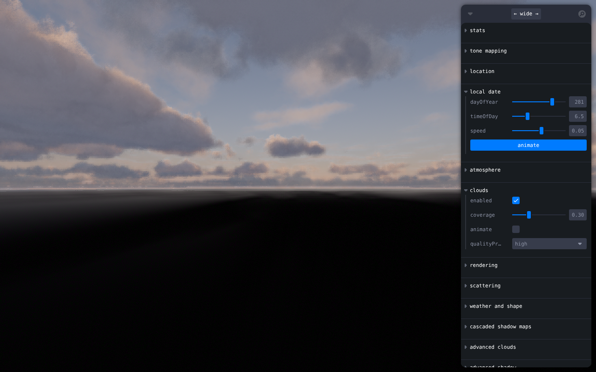
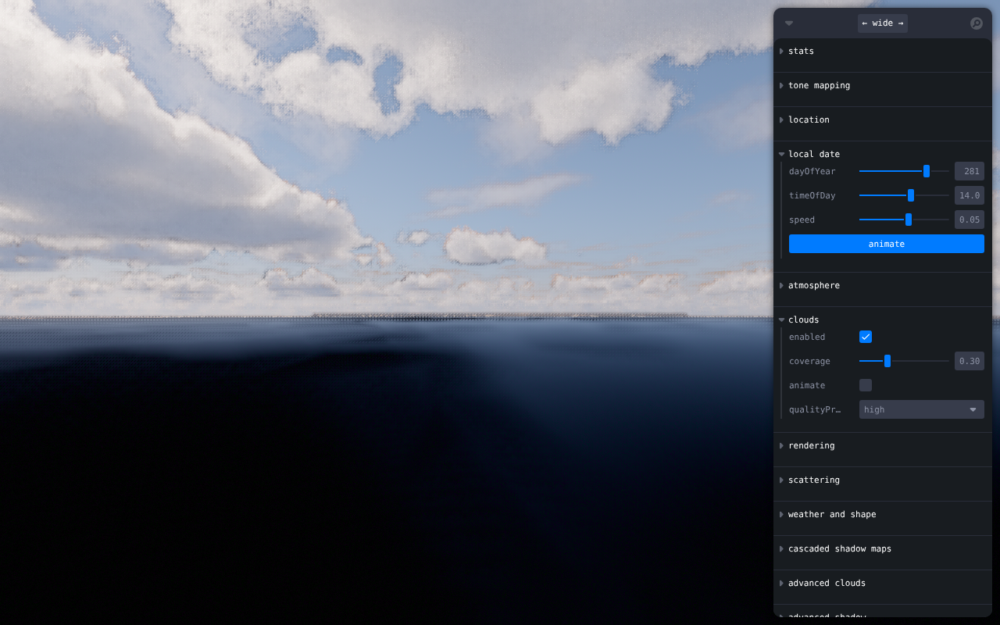
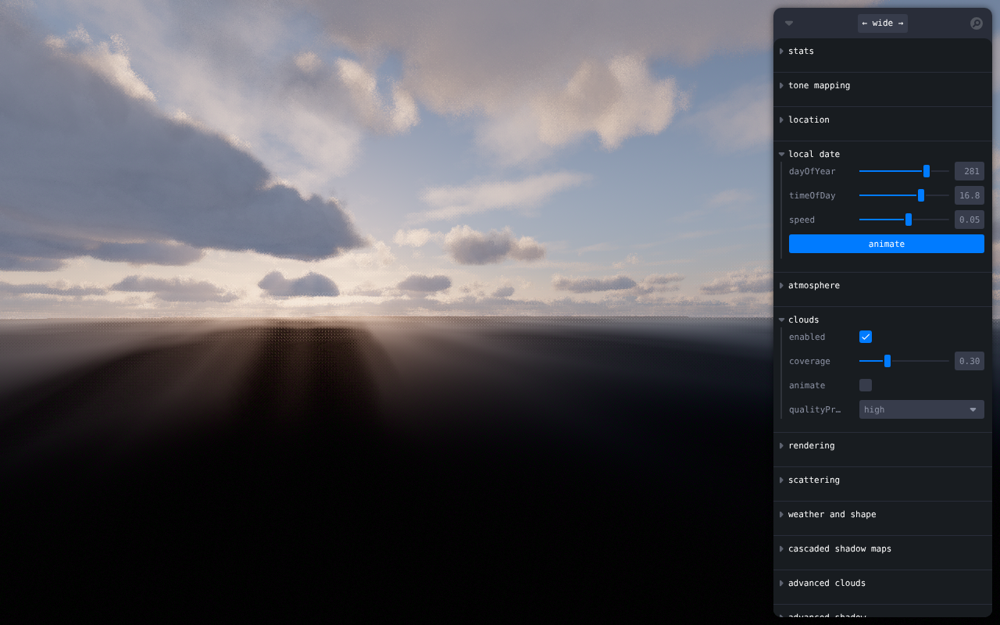
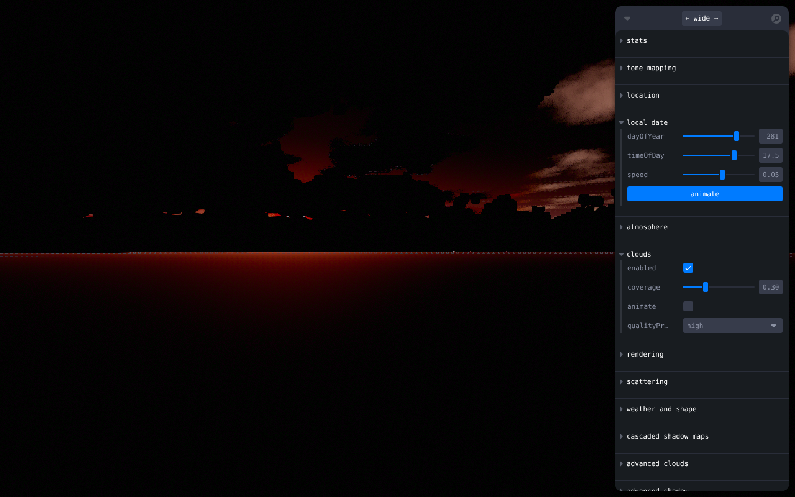

# takram three-geospatial — centered on Jerry's Ranch

[takram-design-engineering/three-geospatial](https://github.com/takram-design-engineering/three-geospatial) (Three.js/R3F precomputed atmospheric scattering + volumetric clouds), with its Storybook re-centered on **Gerry Ranch** ("Jerry's Ranch"), 9015 Rosita Rd, Santa Rosa Valley / Camarillo, CA.

- **Coordinates:** 34.2421°N, −118.9455°W (US Census geocoder, address match)
- **Live Storybook:** https://stuff.evanapplegate.com/takram-jerrys-ranch/storybook/
  (static build committed under `storybook/`, served by this repo's GitHub Pages. Everything works except the film-LUT color-grading dropdowns — 350 MB of LUT pngs left out — and the Google-3D-Tiles stories, which prompt in-story for a Maps API key.)
- To watch lighting change over time: open a story → `local date` panel → drag **timeOfDay** (local solar hours) or hit **animate**. `dayOfYear` sweeps the seasons; `location` panel moves you elsewhere.

## What changed (jerrys-ranch.patch)

Applied on upstream `main` (Oct 2025):

- Default `location` controls → Gerry Ranch (was 0°E 35°N @ 2000 m; now −118.9455 34.2421 @ 300 m) — `storybook/src/helpers/useLocationControls.tsx`
- All stories with hard-coded locations (Tokyo, Fuji, Manhattan, London, 67°N midnight sun…) → Gerry Ranch; added a **JerrysRanch** story to both "3D Tiles Renderer Integration" sections (needs a Google Maps 3D Tiles API key, paste-in prompt appears in-story)
- Stories pass `textures='atmosphere'` so the atmosphere loads the repo's pre-baked LUTs instead of generating them on the GPU at startup (faster, and required under software GL)
- Date defaults → today instead of Jan 1 (`dayOfYear` overrides removed)
- `pnpm-workspace.yaml`: allowlist build scripts (esbuild/swc/nx/sharp) so `pnpm install` works non-interactively under pnpm 10

## Run locally

```sh
git clone https://github.com/takram-design-engineering/three-geospatial  # needs git-lfs for textures
cd three-geospatial
git apply /path/to/jerrys-ranch.patch
pnpm install
cd storybook && pnpm exec storybook dev -p 6006
```

## Screenshots (Oct 8, day 281, local solar time)

Sky story:

| | | |
|---|---|---|
|  06:10 |  09:00 |  12:00 |
|  15:00 |  17:42 | |

Clouds story:

| | |
|---|---|
|  06:30 |  14:00 |
|  16:45 |  17:30 |

(Rendered headless under SwiftShader — grain/speckle in the cloud shots is the software rasterizer mid-accumulation, not the library. On a real GPU it's clean and real-time.)
